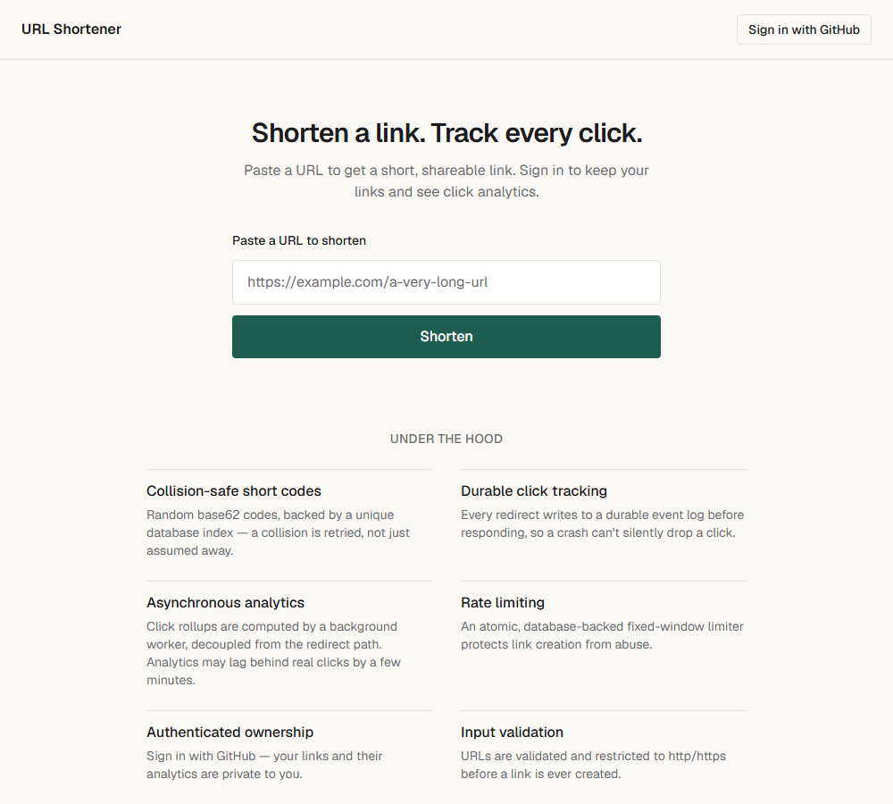
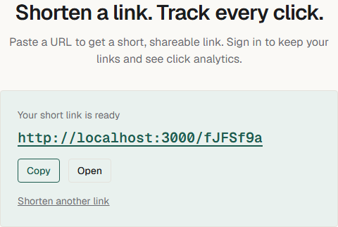
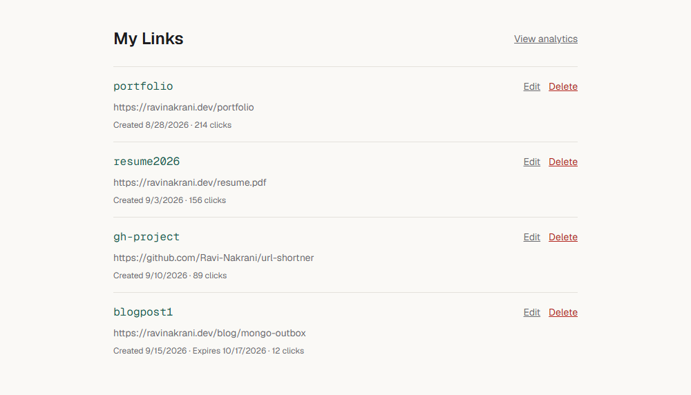
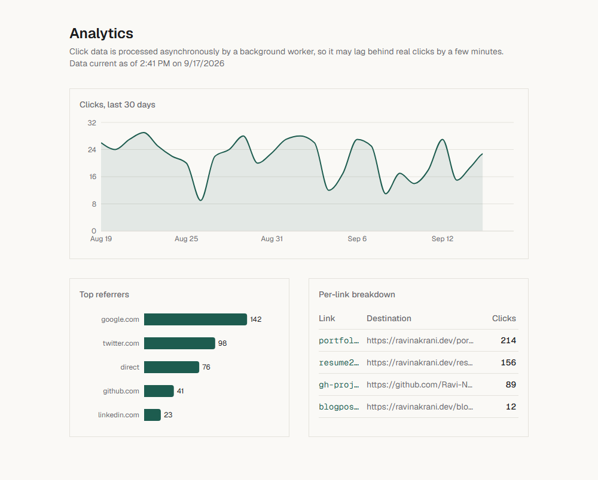
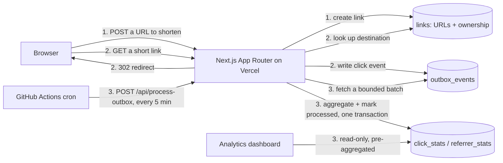

# URL Shortener

A URL shortener with click analytics, built to show real backend engineering — not just
CRUD: durable click tracking via an outbox pattern, a crash-safe async analytics
pipeline with its own concurrency lock, collision-safe short codes, and
authenticated, ownership-scoped link management. Runs entirely on free-tier
infrastructure (Vercel + MongoDB Atlas M0 + GitHub Actions).

**[Live Demo](https://url-shortner-ravi-nakrani.vercel.app/)** ·
**[GitHub](https://github.com/Ravi-Nakrani/url-shortner)**

## Screenshots

| Home                                       | Short link result                                |
| ------------------------------------------ | ------------------------------------------------ |
|  |  |

| My Links                                     | Analytics                                              |
| -------------------------------------------- | ------------------------------------------------------ |
|  |  |

_(Dashboard and analytics screenshots use representative demo data, since this is
per-user data behind sign-in — the components are the real ones, populated with
realistic numbers rather than one account's actual history.)_

## Why I Built This

Most portfolio URL shorteners are a form, a database write, and a redirect. That's
maybe an hour of work and doesn't say much about how someone thinks about production
systems. I built this one to deliberately hit the interesting edges: what happens when
the click-tracking write and the redirect can't both be guaranteed to succeed, what
happens when two background workers run at the same time, what happens when someone
tries to read another user's data. Those are the questions this README — and
[DECISIONS.md](DECISIONS.md), which logs every architectural choice phase by phase — try
to answer honestly, including the places I initially got something wrong and fixed it.

## Features

- **Link shortening** with collision-safe short codes and per-owner duplicate detection
- **Optional link expiry** — an owner can set or clear an expiration date; an expired
  short code redirects the same way a nonexistent one does (a plain 404), rather than
  leaking that the code once existed
- **Durable click tracking** — click events are persisted to a durable outbox before
  the redirect, whenever the write succeeds (see [Reliability](#reliability) for the
  precise, honest version of this claim)
- **Asynchronous analytics** — clicks over time, top referrers, and a per-link
  breakdown, computed by a background worker decoupled from the redirect path
- **Authentication & ownership** — sign in with GitHub or Google to keep your links
  private and see their analytics; every read and write is scoped to the signed-in owner
- **Rate limiting** on link creation, to keep the free tier from being trivially abused
- **Input validation** — URLs are parsed and restricted to `http`/`https` before a link
  is ever created, rejecting `javascript:`/`data:` payloads outright

Every one of these is real, running code — not aspirational. See
[Architecture](#architecture) below for how each is actually implemented.

## Architecture



**Paths 1 and 2 are synchronous** — a browser is waiting on either request, so each does
the minimum necessary work: path 1 validates and inserts a link; path 2 looks up the
destination, writes one small durable event, and redirects. **Path 3 is entirely
asynchronous** and runs on a completely different schedule (a GitHub Actions cron job,
not triggered by user traffic at all) — a slow or failed analytics run can never make a
redirect or a link creation slower or fail. The dashboard only ever reads the
pre-aggregated rollup collections, never the raw event log, so its query cost doesn't
grow with how large the outbox backlog gets.

Everything above lives in one MongoDB Atlas cluster, across five collections doing five
distinct jobs — no separate datastore per concern:

| Collection                       | Holds                                                                                                                                                                                                                                       |
| -------------------------------- | ------------------------------------------------------------------------------------------------------------------------------------------------------------------------------------------------------------------------------------------- |
| `links`                          | short codes, destinations, **and ownership** — there's no separate users/accounts collection, since sessions are JWT-based and store nothing server-side; ownership is just the signed-in provider's account id on the link document itself |
| `outbox_events`                  | one durable row per click, written synchronously, read only by the drain                                                                                                                                                                    |
| `rate_limits`                    | one counter document per identifier + time window, self-expiring via a TTL index                                                                                                                                                            |
| `click_stats` / `referrer_stats` | the pre-aggregated rollups the dashboard actually reads                                                                                                                                                                                     |

### Request paths, concretely

- **Redirect** (`GET /[shortCode]`): look up the link → write an outbox event → `302`
  redirect. If the outbox write fails, the redirect still succeeds — losing one
  analytics event is preferable to failing a user-facing redirect over it.
- **Analytics drain** (`POST /api/process-outbox`, called by the cron job): claim a
  short-lived lock → fetch up to 200 unprocessed events → aggregate them in memory →
  commit the rollup writes and mark those events processed **in one MongoDB
  transaction** → release the lock.
- **Analytics read** (`GET /api/analytics`, and the dashboard page): three aggregation
  queries against the rollup collections only, scoped to the signed-in user's own short
  codes.

## Why This Architecture?

**MongoDB, not Postgres/Redis/a queue** — the brief was to build production patterns on
top of one database, on free-tier infrastructure. MongoDB Atlas's M0 tier gives a real
replica set (so multi-document transactions genuinely work, not just single-document
atomicity) at no cost, which is what makes the outbox pattern below safe to implement
without paying for a managed queue.

**Random base62 short codes + a unique index**, not a counter — an incrementing counter
needs its own atomic increment (a single point of write contention) and leaks link
volume and creation order through the short code itself. A random 7-character code
(62⁷ ≈ 3.5 trillion possibilities) makes collisions negligible, and turns the database's
own unique constraint into the single source of truth for collision-freedom: on a
duplicate-key error, retry with a fresh code. No separate "check, then insert" step that
could race under concurrent requests.

**The outbox pattern for click tracking, not a fire-and-forget write** — a
"fire-and-forget" analytics call in a serverless function isn't reliable; the execution
environment can be frozen or torn down before an unawaited promise resolves, silently
dropping the click. Writing one small, durable event synchronously (but cheaply) as part
of the redirect request guarantees it's recorded before the function returns, while
keeping the actual aggregation work entirely out of the redirect's critical path.

**Asynchronous analytics via a GitHub Actions cron job, not Kafka/RabbitMQ/a managed
queue** — Vercel's free tier limits its own Cron Jobs to once a day, which would leave
analytics stale for hours, so an external trigger is needed regardless. GitHub Actions'
scheduled workflows are free and support 5-minute granularity, calling a
secret-protected endpoint. This is a deliberate portfolio/free-tier tradeoff, not a claim
that polling a cron-triggered HTTP endpoint is the ideal design at every scale — a real
message broker would be the right call once volume or latency requirements outgrow
"good enough within 5 minutes."

**MongoDB-based rate limiting, not Redis** — a single atomic
`findOneAndUpdate({key}, {$inc:{count:1}}, {upsert:true})`, keyed by identifier and the
current fixed window, gets the same race-free guarantee a dedicated rate-limiter would,
without a second infrastructure dependency. The known tradeoff (a client can burst up to
2× the limit across a window boundary) is a deliberate, documented one — see
[Tradeoffs & Limitations](#tradeoffs--limitations).

Every decision above — plus several more, and the alternatives considered and rejected
for each — is logged in detail in [DECISIONS.md](DECISIONS.md), including the exact
verification performed against the real database for each one.

## Reliability

- **The precise click-tracking guarantee, stated honestly**: a redirect writes its click
  event to the durable outbox _before_ responding, and if that write succeeds, the event
  is safe — it will be aggregated by the next drain regardless of what happens
  afterward. If the write itself fails (a transient database error, a timeout), the
  redirect still succeeds and that one click goes unrecorded. This is a deliberate
  tradeoff — a user is waiting on the redirect, so failing it over a lost analytics event
  would be worse than the gap itself — not a claim that every click is guaranteed to be
  recorded under all conditions.
- **A crash mid-analytics-drain can't double-count clicks**: the rollup writes and the
  "mark these events processed" update run inside one MongoDB transaction, so a crash
  at any point either commits the whole batch or none of it. Verified with a test that
  forces the transaction to throw mid-batch and confirms nothing was written.
- **Two overlapping drain runs can't double-count clicks either** — a real gap found
  during a later reliability audit (a scheduled run colliding with a manual trigger, or
  a retried request, could both aggregate the same batch). Closed with a short-lived
  database lock; see [DECISIONS.md](DECISIONS.md#testing--reliability-pass) for how this
  was verified against the real database with genuinely concurrent requests.
- **A stalled lock holder can't corrupt a newer worker's lock either** — a follow-up
  hardening pass found that the lock's original release was unconditional: a worker that
  stalled past its own lease and then resumed could clear a lock a newer worker had
  since legitimately acquired. Fixed with a per-acquisition fencing token (see
  [DECISIONS.md](DECISIONS.md#phase-9)) — a worker's release, and its lease renewal
  inside the drain's own transaction, only succeed while it's still the recorded owner.
- **A short-link redirect uses `302`, not `301`** — this was actually the opposite
  choice originally, reasoned about only in terms of cacheability. A `301` gets cached by
  the visitor's browser, which means a returning visitor's repeat clicks never reach the
  server again — silently undercounting the exact thing this app exists to measure. Kept
  as `302` deliberately, at the cost of one extra database lookup per redirect.
- **Eventual consistency is surfaced, not hidden**: the analytics dashboard states
  outright that click data is processed asynchronously and may lag behind real clicks by
  a few minutes, alongside a live "data current as of" timestamp from the last drain.

## Security

- **Ownership is enforced everywhere, not just checked at the edge**: every read/write
  against a link is scoped by `{shortCode, userId}` at the query level, not filtered
  after the fact. Trying to edit or delete a link you don't own returns a plain `404`,
  not a `403` — the API never confirms that a short code you don't own even exists.
- **Input validation**: URLs are parsed with `zod`, restricted to `http`/`https`, and
  capped at 2048 characters before a link is ever created — `javascript:` and `data:`
  payloads are rejected outright.
- **The outbox drain endpoint requires a shared secret** (`x-outbox-secret`, checked
  against `OUTBOX_SECRET`) — without it, `POST /api/process-outbox` returns `401` and
  performs no writes, so it can't be triggered or abused by an outside caller.
- **This app is an open redirect by design, not by accident** — a URL shortener's entire
  job is to send visitors somewhere else, so "redirects anywhere" isn't a vulnerability
  here the way it would be on, say, an auth callback endpoint. What _is_ validated is the
  input at creation time (must be a well-formed `http`/`https` URL, can't point back at
  this app itself).
- **Short codes come from a CSPRNG**, not `Math.random()` — `crypto.randomInt` isn't
  predictable from previously issued codes, closing a theoretical short-code-guessing
  angle. Same base62 alphabet, length, and unique-index-backed collision retry as before.
- **Rate-limit identification trusts a specific, documented header, not any client-sent
  one** — `x-vercel-forwarded-for` (falling back to `x-forwarded-for`, then `x-real-ip`)
  is used as the rate limiter's identifier. On this app's actual deployment (Vercel),
  these headers are set by Vercel's own edge network, which — per Vercel's docs —
  overwrites `x-forwarded-for` and does not forward client-supplied values, specifically
  to prevent IP spoofing. A client rotating an arbitrary header value can't rotate past
  this on the real deployment; locally (`npm run dev`, no Vercel edge in front), any
  header value is trivially forgeable, which is an accepted, dev-only limitation.
- **A small, verified-compatible set of security headers** on every response:
  `X-Content-Type-Options`, `X-Frame-Options`, `Referrer-Policy`, `Permissions-Policy`,
  and `Strict-Transport-Security` in production. No `Content-Security-Policy` — see
  [Tradeoffs & Limitations](#tradeoffs--limitations) for why.
- **Not currently implemented** (worth naming rather than pretending they don't matter):
  no phishing/malware destination scanning on the URLs people shorten, no abuse-reporting
  flow, and rate limiting is a single-node-friendly MongoDB counter rather than a
  distributed limiter — all reasonable next additions for a version of this meant to be
  opened up to the public rather than run as a personal/portfolio tool.

## Testing

97 tests across 12 files (`npm test`), covering the business logic that actually matters
rather than chasing a coverage percentage: short-code generation and collision retry,
URL validation (including rejecting `javascript:`/`data:`), link creation and per-owner
deduplication, ownership-scoped update/delete (both at the service layer and, separately,
at the HTTP route layer — confirming an unauthenticated request never reaches the
database and a wrong-owner request gets a plain 404), rate limiting's atomic upsert and
its client-IP header trust order, the redirect route's actual HTTP behavior (status
code, click recording, a styled 404 for a missing or expired link, click-tracking
failures not breaking the redirect), the outbox drain's crash/retry/lock-contention
behavior — including the stale-worker fencing scenario below — and the security headers
config. See [DECISIONS.md](DECISIONS.md#testing--reliability-pass) for the specific
gaps a previous audit found and closed, and [DECISIONS.md](DECISIONS.md#phase-9) for
this hardening pass's regression tests.

```
Tests:     56/56 → 97/97 across the project's lifetime, all passing
Typecheck: tsc --noEmit, clean
Lint:      ESLint (Next.js config), clean
Build:     next build, clean production build
```

## Tradeoffs & Limitations

Being honest about what this _isn't_:

- **Single GitHub OAuth App in this deployment** — the original plan was one OAuth App
  per environment (dev + prod), but only a production one was actually registered.
  Local sign-in therefore doesn't work out of the box; local development exercises
  everything except the authenticated flows unless you register your own dev OAuth App
  (instructions below).
- **No account linking across providers** — `userId` is just the signed-in provider's
  raw account id (`account.providerAccountId`), with no adapter and no shared-email
  merge step. The same person signing in with GitHub and then with Google gets two
  independent identities and two separate "My Links" lists, not one merged account —
  a direct consequence of the JWT-only, no-database-adapter design chosen in Phase 5.
- **`outbox_events` grows without bound** — processed events are kept, not deleted, to
  preserve the raw per-click record for reprocessing if the aggregation logic ever
  changes. At real scale, this needs a TTL index expiring processed events after a
  retention window.
- **Fixed-window rate limiting**, not sliding-window — simpler to reason about and
  implement as one atomic operation, but a client can send up to the limit at the very
  end of one window and again at the start of the next, briefly admitting up to 2× the
  limit. Accepted as a bounded, self-limiting edge case for this scale.
- **Analytics can lag by up to ~5 minutes** — bounded by the GitHub Actions cron
  schedule, which is the most frequent interval GitHub reliably honors on the free tier.
- **No caching layer in front of the redirect's database lookup** — every redirect does
  one MongoDB read. At meaningfully higher traffic, a cache (Redis, or an edge KV) in
  front of hot `shortCode → longUrl` lookups would be the first thing added.
- **No real message queue** — the outbox is a polled MongoDB collection, not
  SQS/Kafka/a managed queue. That's a deliberate scope decision for a project meant to
  demonstrate the _pattern_ on one piece of infrastructure, not a claim that this is how
  you'd build it at real scale.
- **No Content-Security-Policy** — deliberately not added in the security-headers
  hardening pass rather than shipped as a fake/permissive one just to have a CSP present.
  A meaningful CSP here would need nonce plumbing through the root layout for Next.js App
  Router's own inline hydration scripts, plus either removing or hashing the redirect
  route's hand-rolled 404 page's inline `<style>` block
  ([src/lib/http/notFoundPage.ts](src/lib/http/notFoundPage.ts)) — real, non-trivial
  changes to the rendering path, not a one-line header addition. Named as a gap here
  rather than silently skipped.
- **The repository/package name is `url-shortner`** (missing an "e") while the product
  is titled "URL Shortener" everywhere else — a naming slip caught late. Left as-is
  rather than renamed, since renaming a GitHub repo with a live Vercel deployment
  attached to it risks breaking that deployment's git integration.
- **MongoDB Atlas Network Access is set to `0.0.0.0/0`** (allow-from-anywhere) — Vercel's
  serverless functions run on a pool of IPs that change and aren't published, so a
  traditional IP allowlist doesn't work against them out of the box. Access is still
  gated by the connection string's credentials, so this isn't an open database, but
  it's a wider network surface than an IP-restricted one. The production-appropriate
  alternative is Vercel's [Secure Compute](https://vercel.com/docs/secure-compute) (static
  outbound IPs an allowlist can actually reference) or Atlas's own PrivateLink — both add
  cost/complexity not justified for a portfolio-scale project, which is why this uses the
  simpler option and names the tradeoff here instead of hiding it.

## Local Development

1. **Clone and install dependencies**

   ```bash
   npm install
   ```

2. **Create a MongoDB Atlas cluster** (free M0 tier) at
   [mongodb.com/atlas](https://www.mongodb.com/atlas), grab its connection string, and
   allow access from anywhere (`0.0.0.0/0`) under Network Access — Vercel's serverless
   functions don't have a fixed IP.

3. **(Optional) Create GitHub and/or Google OAuth credentials** if you want to exercise
   sign-in locally:
   - **GitHub** (GitHub → Settings → Developer settings → OAuth Apps → New OAuth App):
     Homepage URL `http://localhost:3000`, Authorization callback URL
     `http://localhost:3000/api/auth/callback/github`.
   - **Google** (Google Cloud Console → APIs & Services → Credentials → Create
     Credentials → OAuth client ID → Web application): Authorized redirect URI
     `http://localhost:3000/api/auth/callback/google`.

   Both env vars are still required for the app to start even if you skip this step —
   any placeholder string satisfies the startup validation, it just means that
   provider's sign-in button won't work. Without real credentials, everything except
   the authenticated flows works locally.

4. **Configure environment variables**

   ```bash
   cp .env.local.example .env.local
   ```

   Fill in `.env.local`:
   - `MONGODB_URI` — your Atlas connection string.
   - `OUTBOX_SECRET` — any random string (e.g. `openssl rand -hex 32`).
   - `AUTH_SECRET` — `openssl rand -base64 32`.
   - `AUTH_GITHUB_ID` / `AUTH_GITHUB_SECRET` — from the GitHub OAuth App above, if
     created (any non-empty placeholder otherwise).
   - `AUTH_GOOGLE_ID` / `AUTH_GOOGLE_SECRET` — from the Google OAuth client above, if
     created (any non-empty placeholder otherwise).

5. **Run the dev server**

   ```bash
   npm run dev
   ```

   Visit [http://localhost:3000](http://localhost:3000). Check
   [http://localhost:3000/api/health](http://localhost:3000/api/health) to confirm the
   database connection is working.

### Scripts

| Command                | Purpose                                  |
| ---------------------- | ---------------------------------------- |
| `npm run dev`          | Start the Next.js dev server             |
| `npm run build`        | Production build                         |
| `npm run lint`         | ESLint                                   |
| `npm run typecheck`    | `tsc --noEmit`                           |
| `npm test`             | Run the Vitest test suite                |
| `npm run format`       | Format the codebase with Prettier        |
| `npm run format:check` | Check formatting without writing changes |

A pre-commit hook (Husky + lint-staged) runs lint and format checks automatically on
staged files.

### Deployment

Deployed on Vercel. Set `MONGODB_URI`, `OUTBOX_SECRET`, `AUTH_SECRET`, `AUTH_GITHUB_ID`,
`AUTH_GITHUB_SECRET`, `AUTH_GOOGLE_ID`, and `AUTH_GOOGLE_SECRET` in the Vercel project's
environment variables (using the production OAuth App/client credentials for each
provider, not the dev ones).

The outbox-drain scheduler (`.github/workflows/drain-outbox.yml`) needs two GitHub
Actions repository secrets (Settings → Secrets and variables → Actions): `APP_URL`
(the Vercel production URL) and `OUTBOX_SECRET` (matching Vercel's value).

---

See [DECISIONS.md](DECISIONS.md) for the full, phase-by-phase design-decisions log —
every architectural choice, the alternatives rejected, and the verification performed
against the real database for each one.
